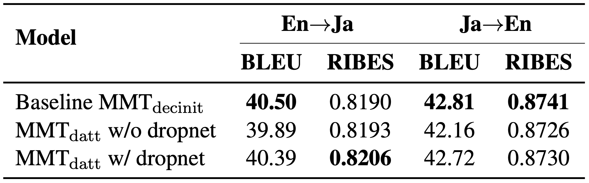

# mmt-dropnet

Code for WAT 2020 paper : "TMU Japanese-English Multimodal Machine Translation System for WAT 2020" \[[paper](https://aclanthology.org/2020.wat-1.7/)\] \[[presentation](https://www.youtube.com/watch?v=pljsLkRMWDQ)\].

This code is based on [nmtpytorch](https://github.com/lium-lst/nmtpytorch/tree/v4.0.0) (v4.0.0), so you follow this for an instllation and a fundamental usage.

## Dropnet method


Inspired by [Zhu et al.(2020)](https://openreview.net/forum?id=Hyl7ygStwB), we drop either the textual or the visual context vector in the decoder while training.
This aims to regularize the network
to make use of both features effectively.

Specifically, at each decoding step :

- with probability p_{net}/2 : Either the textual or the visual context vector is selected to compute the multimodal context vector.
- with probability (1-p_{net}) : Both context vectors are used for computing the multimodal context vector.

where dropnet rate $ p_{\textrm{net}} \in [0, 1] $.

For more details, see our paper.

#### WAT 2020 MMT-en-ja task results


## Usage of dropnet method
If you use dropnet method, you should modify a configuration file like [this](docs/examples/v4.0.0/mmt-task-en-fr-multimodalatt-dropnet.conf).

In our paper, we set dropnet rate to 0.3, that is 0.15 for *dropnet_image_rate*, 0.15 for *dropnet_text_rate*.

You can control the dropnet rate flexibly, in other words, you can set different probabilities to pick up context vectors for visual and textual.

## Installation & Usage
Please refer to [nmtpytorch](https://github.com/lium-lst/nmtpytorch/tree/v4.0.0).
## Requirment
- Python 3.6.10
- torch 1.0.0

## Citation
If you use this code, please cite **nmtpytorch**'s [paper](https://ufal.mff.cuni.cz/pbml/109/art-caglayan-et-al.pdf) :
```
@article{nmtpy2017,
  author    = {Ozan Caglayan and
               Mercedes Garc\'{i}a-Mart\'{i}nez and
               Adrien Bardet and
               Walid Aransa and
               Fethi Bougares and
               Lo\"{i}c Barrault},
  title     = {NMTPY: A Flexible Toolkit for Advanced Neural Machine Translation Systems},
  journal   = {Prague Bull. Math. Linguistics},
  volume    = {109},
  pages     = {15--28},
  year      = {2017},
  url       = {https://ufal.mff.cuni.cz/pbml/109/art-caglayan-et-al.pdf},
  doi       = {10.1515/pralin-2017-0035},
  timestamp = {Tue, 12 Sep 2017 10:01:08 +0100}
}
```
and our [paper](https://aclanthology.org/2020.wat-1.7/) :
```
@inproceedings{tamura-etal-2020-tmu,
    title = "{TMU} {J}apanese-{E}nglish Multimodal Machine Translation System for {WAT} 2020",
    author = "Tamura, Hiroto  and
      Hirasawa, Tosho  and
      Kaneko, Masahiro  and
      Komachi, Mamoru",
    booktitle = "Proceedings of the 7th Workshop on Asian Translation",
    month = dec,
    year = "2020",
    address = "Suzhou, China",
    publisher = "Association for Computational Linguistics",
    url = "https://aclanthology.org/2020.wat-1.7",
    pages = "80--91",
    abstract = "We introduce our TMU system submitted to the Japanese{\textless}-{\textgreater}English Multimodal Task (constrained) for WAT 2020 (Nakazawa et al., 2020). This task aims to improve translation performance with the help of another modality (images) associated with the input sentences. In a multimodal translation task, the dataset is, by its nature, a low-resource one. Our method used herein augments the data by generating noisy translations and adding noise to existing training images. Subsequently, we pretrain a translation model on the augmented noisy data, and then fine-tune it on the clean data. We also examine the probabilistic dropping of either the textual or visual context vector in the decoder. This aims to regularize the network to make use of both features while training. The experimental results indicate that translation performance can be improved using our method of textual data augmentation with noising on the target side and probabilistic dropping of either context vector.",
}

```